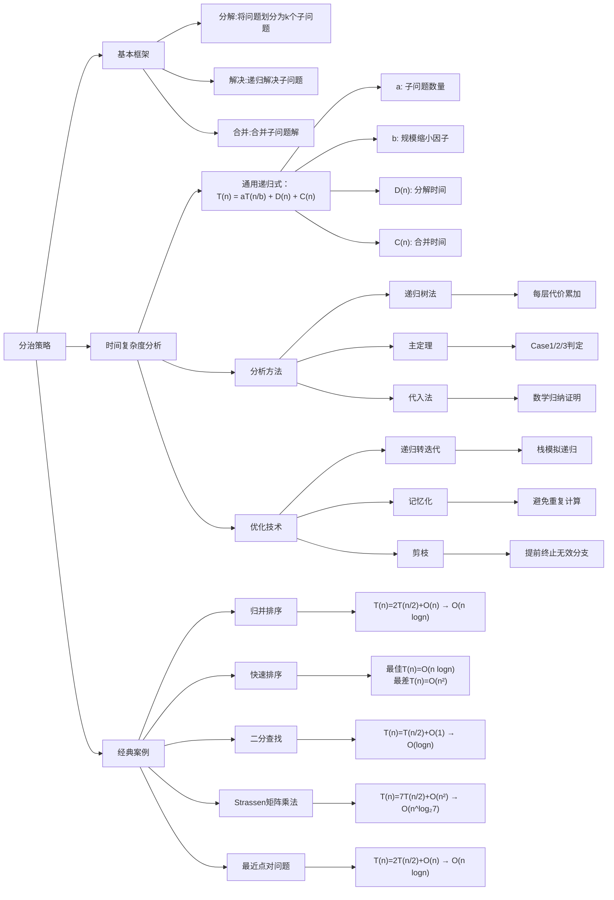

## 算法引入

在解决较困难问题时我们可以将问题拆解，直到拆解为规模足够小的问题，我们称之为**基本情况**。同时需要注意：子问题的规模不必是原问题规模的一个固定比例，例如：分治排序若每次将数组分为长度为n-1和1的两组，其递归时间复杂度为 $T(n) = T(n-1) + O(1)$

对于几个常见例子：最大化连续区间和、传统矩阵分治乘法（相比BF无优化）、矩阵乘法Strassen算法等，本笔记只着重于Strassen算法的内容整理。

### Strassen算法

传统矩阵算法步骤如下：

$$
C_{i,j} = \sum_{k=1}^{n} A_{i,k}B_{k,j} \quad \Rightarrow O(n^3)

$$

基本步骤如下：

1. 将将n×n矩阵分割为4个(n/2)×(n/2)子矩阵
2. 递归计算7个矩阵乘积
3. 通过加减组合得到结果矩阵

接下来以2x2矩阵举例，其算法关键在于其计算的7个矩阵乘积

$$
A = \begin{bmatrix}
A_{11} & A_{12} \\
A_{21} & A_{22}
\end{bmatrix}, \quad
B = \begin{bmatrix}
B_{11} & B_{12} \\
B_{21} & B_{22}
\end{bmatrix} 
$$
$$
\begin{aligned}
M_1 &= (A_{11}+A_{22})(B_{11}+B_{22}) \\
M_2 &= (A_{21}+A_{22})B_{11} \\
M_3 &= A_{11}(B_{12}-B_{22}) \\
M_4 &= A_{22}(B_{21}-B_{11}) \\
M_5 &= (A_{11}+A_{12})B_{22} \\
M_6 &= (A_{21}-A_{11})(B_{11}+B_{12}) \\
M_7 &= (A_{12}-A_{22})(B_{21}+B_{22})
\end{aligned}
$$
$$
C = \begin{bmatrix} M_1+M_4-M_5+M_7 & M_3+M_5 \\ M_2+M_4 & M_1-M_2+M_3+M_6 \end{bmatrix}
$$
其复杂度分析：

$$
T(n) = \begin{cases} O(1) & \text{当 } n=1 \\ 7T(n/2) + 18(n/2)^2 & \text{当 } n>1 \end{cases}
$$
关键在于 $T(n/2)$ 前的系数由传统方法的8降为了7，在大矩阵乘法计算时优势极为明显。接下来学习如何化简递推式。

## 分治算法时间复杂度的分析

### 代入法

1. 猜测解的形式
2. 使用数学归纳法证明

关键在于如何“猜”：Attention is all your need。但是存在一些启发式的方法帮助猜测；或者是先证明递归式较松的上界和下界，运用类似夹逼的思想逼近紧确界

## 递归树方法

注意到，不是每个人都有很强的注意力，所以我们可以使用**递归树**方法计算。下面用一个实际例子来说明递归树方法：

首先构造 $T(n) = aT(n/b) + f(n)$ 的递归树：

- 根节点：$f(n)$ （当前层代价）
- 子节点：共 $a$ 个分支，每个分支对应 $T(n/b)$
- 递归构造直到叶子结点 $T(1)$
第ic
$$
\begin{cases}
递归深度: i \\
问题规模: n/b^i \\
节点数: a^i \\
每层总代价: a^i \cdot f(n/b^i)
\end{cases}
$$