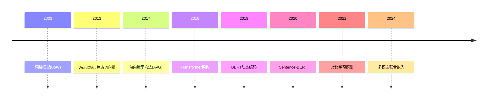

## 什么是嵌入模型

**嵌入（Embedding）** 是将**高维离散数据**（如文本/图像）转化为**低维连续向量**的过程。计算机对于自然语言并不能理解，但是转化为语义相关的向量后，可以进行距离计算相似度计算等操作。形象化的说，嵌入模型最终可以将人类能看懂的自然语言转化为机器能看懂与比较的向量，充当“翻译官”的角色。

与 `One-Hot` 不同， `One-Hot` 只会为每个词分配一个唯一的二进制向量，也就是只是告诉了计算机如何辨别不同的词，但并无法比较不同词的相近程度。

## 主要嵌入模型

|类型|代表模型|特点|应用场景|
|---|---|---|---|
|**词嵌入**|Word2Vec, GloVe|静态词向量，无上下文|传统NLP任务|
|**上下文嵌入**|BERT, ELMo|动态向量，根据句子上下文变化|语义理解、QA系统|
|**跨模态嵌入**|CLIP, ViLBERT|统一文本/图像向量空间|图文检索、生成|
|**图嵌入**|Node2Vec, GCN|捕捉图结构关系|社交网络、推荐系统|

（deepseek整理）

## 句子向量化

顾名思义，句子向量化可以将一整个句子转化为一个数值向量。

最早的词袋模型过于古老，不在此阐述，其具有大量缺点，例如：无法捕捉词序、维度灾难等。

