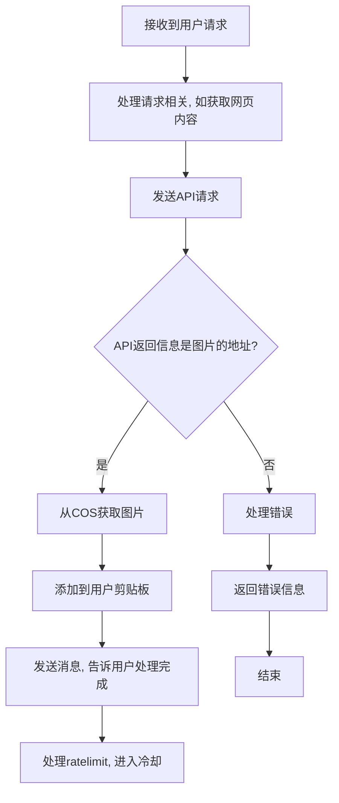

[VVQuest](https://github.com/MemeMeow-Studio/VVQuest) 这项目感觉还是需要一个浏览器插件才能发挥，而对于浏览器插件开发又不熟悉，遂尝试用 `Claude 3.7` 开发。

前期的开发过程记录仅供参考。

## 如何开发谷歌插件？

查阅 [Google 提供的文档](https://developer.chrome.com/docs/extensions?hl=zh-cn) 并与LLM对话了解到 Chrome 插件最基础的目录结构

```perl
my-extension/
├── manifest.json     # 插件配置文件（必需）
├── icon.png          # 插件图标
└── popup.html        # 弹出窗口（可选）

```

后续直接在浏览器中加载插件即可

## 明确功能

首先明确接收到用户请求后的基础流程



## 编写提示词

目前的 LLM 受提示词的影响还是较大，且为了使我对其生成的代码可控，我决定让他分步执行操作，并在每一步后进行调试和code review。且我打算采用知识库+Deepseek R1生成合适准确的提示词。

此处就不附上提示词了
